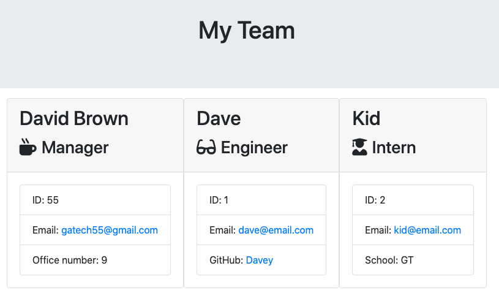

# Template-Engine---Employee-Summary

David K. Brown's Template-Engine---Employee Summary

## Table of Contents

- [Description](#description)

- [Screenshots](#screenshots)

- [Acceptance-Criteria](#Acceptance-Criteria)

- [Installation](#installation)

- [Credits](#credits)

- [Contributing](#contributing)

- [Copyright](#copyright)

## Description

The purpose of this project was to allow a manager the ability to generate a webpage that displays their team's basic info. It gives them a way to quickly access common information like their name and email address while also allowing the manager to see specific information. For Interns the manager is able to see their school. For engineers the manager is able to see their GitHub username. The app also allows the manager to enter their office number incase the employees need to locate them.

## Screenshots




## Acceptance-Criteria

```md
As a manager
I want to generate a webpage that displays my team's basic info
so that I have quick access to emails and GitHub profiles
```

## Installation

To access this project you will need to visit my GitHub page and the "Template-Engine---Employee-Summary" repository. After the repository is cloned/forked you can make edits to the project in your repository. Any questions should be directed to [David Brown](mailto:gatech55@gmail.com). The project can be found here: [EmployeeSummary](https://github.com/GaTech55/Template-Engine---Employee-Summary). The sample README can be found here: [EmployeeSummary](https://github.com/GaTech55/Template-Engine---Employee-Summary/blob/main/Develop/output/team.html).

## Credits

© 2019 Trilogy Education Services, a 2U, Inc. brand. All Rights Reserved.
[GitLab-10-Homework](https://gt.bootcampcontent.com/GT-Coding-Boot-Camp/gt-inc-fsf-pt-08-2020-u-c/tree/master/10-OOP/02-Homework)

## Contributing

| **Commits** | **Contributor** |

| 15 | [GaTech55](https://github.com/GaTech55)|

## Copyright

Copyright (c) 2020 David Brown.
